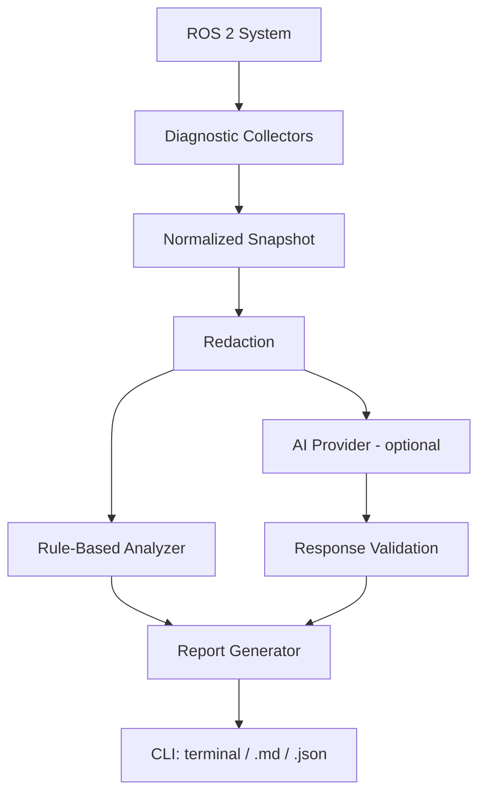

# ros2-ai-debugger

> AI-assisted diagnostics and troubleshooting for ROS 2 systems.

```console
$ ros2 ai diagnose
```

## What is ros2-ai-debugger?

A read-only command-line tool that inspects a running ROS 2 system, normalizes what it finds, applies
deterministic checks, and optionally asks an LLM for a second opinion. The result is an evidence-based
report that keeps three things strictly apart:

| | Meaning | Example |
|---|---|---|
| **OBSERVED** | read directly from the system | `/joint_states has 0 publishers` |
| **INFERRED** | a possible cause, never stated as fact | `joint_state_broadcaster may not be loaded` |
| **RECOMMENDED** | a read-only command you can run | `ros2 control list_controllers` |

## Why it exists

Most ROS 2 debugging starts the same way: run a dozen `ros2 ... list/info/echo` commands, cross-reference
them by eye, and search for the error. This tool automates the collection and the first round of
cross-referencing, and it is honest about what it does not know. It is **not** a "Claude wrapper":
the core works with no API key and no network, and AI is one optional, replaceable provider.

## Features

- `ros2 ai diagnose` integrates as a native `ros2` command (via the `ros2cli` extension point).
- Collectors for nodes, topics (with QoS), services, actions, TF, lifecycle state, ros2_control
  controllers, `/diagnostics`, `/rosout`, and host CPU / memory / disk / network.
- 14 deterministic rules (see [docs/architecture.md](docs/architecture.md)), including QoS
  incompatibility, disconnected TF trees, inactive lifecycle nodes, and missing publishers/servers.
- Optional AI analysis through four providers: Claude, OpenAI, Gemini, Ollama (local).
- AI output is **validated**: strict schema, only components that exist in the snapshot, only allowlisted
  read-only commands.
- Privacy first: nothing is sent unless you ask; `--dry-run`, `--redact`, confirmation before cloud upload.
- Terminal, Markdown (GitHub-issue ready) and JSON reports; JSON reports can be replayed with `--from-snapshot`.
- **Read-only by design.** It never changes your robot or your ROS graph.

## Architecture



Only `collectors/rclpy_backend.py` imports rclpy. Everything else works on plain dataclasses, so the
analyzers, providers and reports are tested without a robot. Details: [docs/architecture.md](docs/architecture.md).

## Installation

Requires Python >= 3.10 and a ROS 2 installation (Humble or Jazzy).

**As a ROS 2 package (recommended; makes `ros2 ai` work):**

```bash
source /opt/ros/humble/setup.bash          # or jazzy
mkdir -p ~/ros2_ws/src && cd ~/ros2_ws/src
git clone https://github.com/Arjunros/ros2-ai-debugger.git
cd ~/ros2_ws && colcon build --packages-select ros2_ai_debugger
source install/setup.bash
ros2 ai doctor
```

**With pip (standalone `ros2-ai` command; for `ros2 ai` the package must be on the Python path `ros2` uses):**

```bash
pip install .                 # rule-based only, no third-party dependencies
pip install '.[claude]'       # + Anthropic SDK for --provider claude
```

OpenAI, Gemini and Ollama use plain HTTPS from the standard library and need no extra packages.

## Quick start

```bash
ros2 ai doctor                       # can the tool work here?
ros2 ai diagnose                     # rule-based diagnosis, nothing leaves your machine
ros2 ai diagnose --output report.md  # shareable Markdown report
ros2 ai diagnose --local             # add analysis by a local Ollama model
ros2 ai diagnose --provider claude --dry-run   # preview exactly what would be sent
```

Try it on a deliberately broken fake robot:

```bash
python3 examples/broken_robot_demo.py     # terminal 1
ros2 ai diagnose                          # terminal 2
```

`ros2 ai diagnose --help` lists every option. Exit code is 0 on success, 2 on usage/tool errors, and
1 if `--fail-on warning|error` matched a finding (handy in CI).

## Example output

Abridged from the reference broken-robot scenario (full version: [examples/sample-report.md](examples/sample-report.md)):

```text
ROS 2 AI DIAGNOSTIC REPORT

System:
  ROS 2 Humble
  Ubuntu 22.04.5 LTS

Overall:
  ⚠ Potential issue detected

FINDING #1  [WARNING]
Component:  /joint_states
Problem:    No publisher detected on /joint_states although it has subscribers

OBSERVED (read directly from the system):
  - /joint_states has 0 publishers
  - /joint_states has 1 subscriber(s): /robot_state_publisher
  - controller manager /controller_manager is running
  - controller 'arm_controller' (...JointTrajectoryController) is active
  - no controller of type JointStateBroadcaster is loaded

INFERRED (possible causes, NOT confirmed):
  1. joint_state_broadcaster is not loaded/spawned in controller_manager
  2. Controller configuration or robot hardware interface failure

RECOMMENDED (read-only checks):
  $ ros2 control list_controllers
  $ ros2 topic info /joint_states --verbose

Confidence: 0.85 (heuristic weight for the top possible cause)
```

> **About confidence.** Confidence values are hand-set heuristic weights for the top inferred cause.
> They are *not* calibrated probabilities. Observations are direct and carry no confidence.

## AI provider configuration

AI analysis is **off by default**. You enable it explicitly with `--local` or `--provider`.

| Provider | Flag | Configuration | Data leaves machine? |
|---|---|---|---|
| Ollama | `--local` / `--provider ollama` | `ollama serve`, `ollama pull <model>`; `OLLAMA_HOST`, `OLLAMA_MODEL` | No (loopback enforced with `--local`) |
| Claude | `--provider claude` | `ANTHROPIC_API_KEY`, `pip install '.[claude]'`, optional `ANTHROPIC_MODEL` | Yes |
| OpenAI | `--provider openai` | `OPENAI_API_KEY`, optional `OPENAI_MODEL`, `OPENAI_BASE_URL` | Yes (unless base URL is local) |
| Gemini | `--provider gemini` | `GEMINI_API_KEY` or `GOOGLE_API_KEY`, optional `GEMINI_MODEL` | Yes |

Use `--model` to override the model. Default model names are only sensible starting points; provider
model catalogs change, so set the one you want. With no key configured, `diagnose` prints a warning and
still returns the full rule-based report. See [docs/providers.md](docs/providers.md).

## Privacy

- **Nothing is sent unless you choose a provider.** Even then, cloud providers show a summary and ask
  for confirmation (`--yes` to skip; non-interactive sessions refuse without it).
- `--dry-run` prints the exact system prompt and payload that would be sent, then exits.
- Never collected or sent: environment variables other than `ROS_DISTRO`, `ROS_DOMAIN_ID`,
  `RMW_IMPLEMENTATION`, `ROS_LOCALHOST_ONLY`; API keys; file contents; camera images or any message
  payloads; robot credentials.
- Secrets in log text (API keys, bearer tokens, `password=...`) are always scrubbed. `--redact` also masks
  hostnames, IPs, MACs, e-mails, usernames and home paths. Markdown reports are always redacted.
- `--local` refuses to talk to a non-loopback Ollama host.

Redaction is pattern-based and **best effort**. Review a report before posting it publicly.
Details: [docs/privacy.md](docs/privacy.md).

## Security

The tool is read-only. It subscribes to `/tf`, `/tf_static`, `/diagnostics`, `/rosout`, queries the graph,
and calls exactly two query services (lifecycle `get_state`, controller manager `list_controllers`). It does not
publish, set parameters, restart or kill anything, execute shell commands, or send motion commands.
Recommended commands pass an allowlist of read-only `ros2` queries (this also applies to LLM output).
Report vulnerabilities as described in [SECURITY.md](SECURITY.md).

## Development

```bash
git clone https://github.com/Arjunros/ros2-ai-debugger.git && cd ros2-ai-debugger
python3 -m venv --system-site-packages .venv && . .venv/bin/activate
pip install -e '.[dev]'
```

Layout: `collectors/` (ROS to raw data to models), `models/`, `analyzers/` (rules, AI prompt/validation),
`providers/`, `privacy/`, `reporting/`, `cli/`, `utils/`.

## Testing

```bash
pytest                                  # unit tests; no ROS or robot needed
source /opt/ros/humble/setup.bash && pytest -m ros   # + live tests against examples/broken_robot_demo.py
```

Unit tests use in-memory fake backends and a deterministic broken-robot scenario with golden reports
(`tests/fixtures/golden/`). Live tests start the demo robot in an isolated `ROS_DOMAIN_ID`.

**Verification status** (be skeptical of anything not on this list):

| Area | Status |
|---|---|
| ROS 2 Humble, Ubuntu 22.04: collectors, rules, `ros2 ai`, colcon install | Tested live |
| ROS 2 Jazzy | **Not yet tested**; APIs used exist in Jazzy but this is unverified |
| Claude provider | Tested against the real SDK with a mocked HTTP transport; **not** against the live API |
| OpenAI, Gemini providers | Unit-tested with mocked HTTP only; not tested against live APIs |
| Ollama provider | Request/response logic unit-tested; a live model run was not achievable on the dev machine |
| Multi-robot / large graphs / non-Linux | Not tested |

## Contributing

See [CONTRIBUTING.md](CONTRIBUTING.md). New rules must be deterministic and justified by data the
snapshot actually contains; new collectors must stay read-only.

## Roadmap

- Verify on Jazzy (CI matrix in Docker) and add further distributions in `utils/distro.py`.
- Live-API verification for each cloud provider.
- Optional GitHub issue creation (`--github` currently only writes `github-report.md`).
- Controlled, opt-in, confirmation-gated remediation (a separate capability; never in the default path).
- More collectors: parameters (read-only), executor/callback latency, QoS deadline/liveliness checks,
  DDS-level discovery details.
- Rule packs for common stacks (Nav2, MoveIt 2, ros2_control) as separate, opt-in modules.

## License

Apache-2.0. See [LICENSE](LICENSE).
