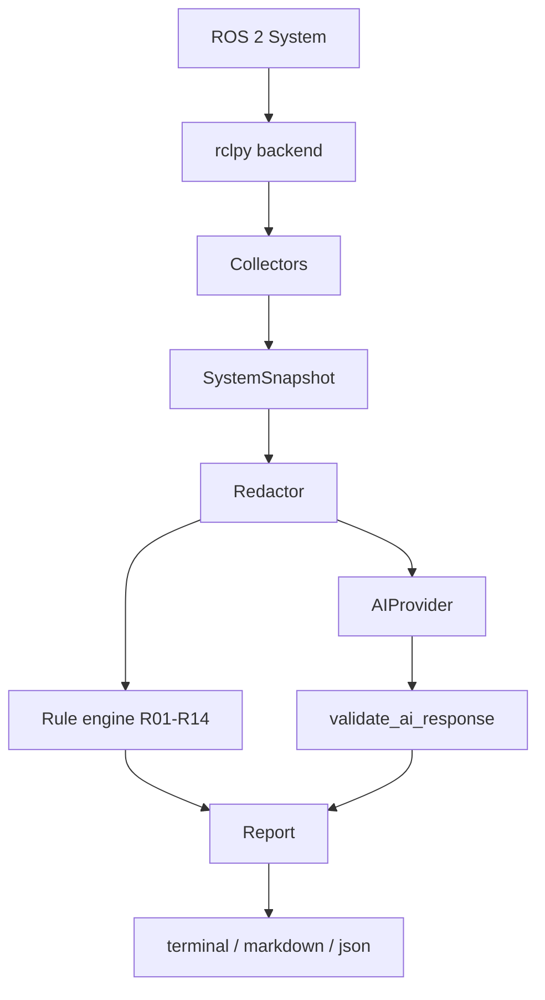

# Architecture

## Layers

| Layer | Package | Depends on ROS? |
|---|---|---|
| Backend (graph access, subscriptions, 2 read-only service queries) | `collectors/rclpy_backend.py` | **Yes, the only module** |
| Collectors (raw data to normalized models, filtering) | `collectors/*.py` | No |
| Data model | `models/` | No (plain dataclasses) |
| Rules | `analyzers/rules.py` | No |
| AI prompt + validation | `analyzers/ai_*.py` | No |
| Providers | `providers/` | No |
| Privacy | `privacy/` | No |
| Reports | `reporting/` | No |
| CLI | `cli/` (`ros2_command.py` is the only ros2cli import) | Only the adapter |

The backend is a `Protocol` (`collectors/base.py: RosBackend`). Tests use an in-memory fake, which makes
the whole pipeline testable without a robot.

## Collectors

Each collector implements `DiagnosticCollector.collect()` and names the `SystemSnapshot` field it fills.
`collect_snapshot()` runs them all; a collector that raises is recorded in `collection_errors` and the rest
continue. Normalization details worth knowing:

- Hidden nodes/topics/services (any segment starting with `_`) and the tool's own node are excluded.
  Topics that exist only because of the tool's own subscriptions are dropped.
- Per-node parameter services (`rcl_interfaces/srv/*`) are omitted from `services`.
- TF: edges from `/tf` and `/tf_static` during `--listen-seconds` (default 2 s). A transform published more
  slowly than that window is missed, which is why the TF finding lists this as a possible cause.
- `/rosout` is subscribed with transient-local durability, so recent entries emitted just before the run
  are included. Only WARN and above are kept (newest 50).
- Lifecycle state: `get_state` is called only on nodes that expose `<node>/get_state` of type
  `lifecycle_msgs/srv/GetState`. Controllers: `list_controllers` is called only on a service of type
  `controller_manager_msgs/srv/ListControllers`. These two are the only service calls the tool makes.

## Rules

| ID | Fires when | Needs config? | Severity |
|---|---|---|---|
| R01 | A node listed in `expected_publishers` does not publish that topic | Yes | warning |
| R02 | Topics have publishers but no subscribers (common system topics ignored) | No | info |
| R03 | A topic has subscribers but no publishers. WARNING for `/joint_states`, `/tf`, `/clock`; INFO otherwise, since idle command topics are normal | No | warning/info |
| R04 | A node in `required_nodes` is not running | Yes | error |
| R05 | TF frames form more than one connected tree | No | warning |
| R06 | A lifecycle node is not `active` (`errorprocessing` is an error) | No | warning/error |
| R07 | A required action server is missing, or an action has clients but no server | Partly | error/warning |
| R08 | CPU, memory or disk usage at or above threshold (default 90%) | No | warning |
| R09 | `ROS_DOMAIN_ID` differs from `expected_domain_id` | Yes | warning |
| R10 | Publisher/subscriber QoS incompatible: BEST_EFFORT vs RELIABLE, VOLATILE vs TRANSIENT_LOCAL | No | error |
| R11 | A ros2_control controller is not `active` | No | warning |
| R12 | No nodes visible at all (domain/RMW/localhost-only/network hints) | No | warning |
| R13 | Recent ERROR/FATAL (warning) or WARN (info) log messages | No | warning/info |
| R14 | A `/diagnostics` status is not OK | No | warning |

R11-R14 go beyond the original list because they use data the collectors already gather. Rules that need
knowledge of *your* robot (R01, R04, R07 required servers, R09) only fire when you provide expectations via
`--config`, `--expect-node` or `--expect-domain-id`. The tool never guesses what your robot requires.

QoS (R10) covers only the two rules decidable from the values rclpy exposes; deadline, lifespan and
liveliness compatibility are not checked. `SYSTEM_DEFAULT`/`UNKNOWN` values are skipped, not guessed.

### Expectations file

JSON (no YAML dependency); unknown keys are rejected to catch typos. See `examples/expected.json`.

## AI stage

`AIProvider.analyze(snapshot, rule_findings)` builds the prompt, calls `complete(system, user)` (the only
method a provider implements), and validates the reply. Validation (`analyzers/ai_validation.py`):

1. Extracts one JSON object; unusable output raises `AIResponseError` and the report falls back to rules.
2. Each finding needs a valid severity, a `component`, and `confidence` in [0, 1]; otherwise it is dropped.
3. `component` must exist in the snapshot (or be `system|graph|tf|logs|environment`).
4. `observed` items citing unknown slash-names are dropped; `recommended_checks` must be allowlisted
   read-only commands naming only known entities. Rejected commands are never echoed.
5. Lists are capped at 10 items, strings at 500 chars.

Validation makes hallucinated *references* detectable. It cannot verify that a model's reasoning is correct,
so AI findings are labeled "validated, not verified".

## Extending

- **New distro:** verify, then add it to `utils/distro.py`.
- **New collector:** subclass `DiagnosticCollector`, add a field to `SystemSnapshot`, register it in
  `collectors/__init__.py: default_collectors`. It must be read-only.
- **New rule:** add a pure function to `analyzers/rules.py` and to `ALL_RULES`. Only use data in the snapshot;
  put inferences in `possible_causes`; use only allowlisted commands (a test enforces this).
- **New provider:** subclass `AIProvider`, implement `complete()`, register in `providers/__init__.py`.
